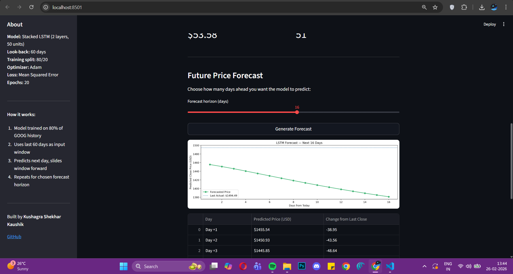
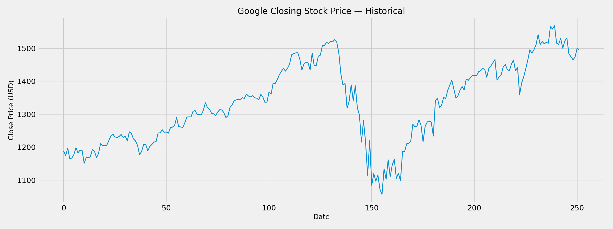
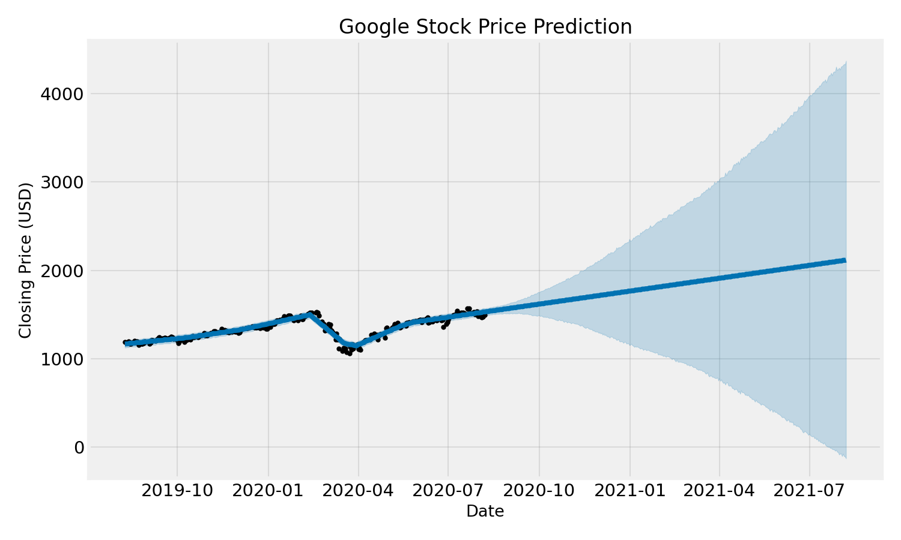

# Google Stock Price Prediction using LSTM

Wanted to go beyond classical ML for this one. Built a stacked LSTM deep learning model to predict Google's stock closing price and then wrapped it in an interactive Streamlit app where you can pick how many days ahead you want to forecast and see the model's prediction day by day.

🚀 **[Live Demo → stock-price-prediction-lstm-mafteelnla8lryaiuucjeg.streamlit.app](https://stock-price-prediction-lstm-mafteelnla8lryaiuucjeg.streamlit.app/)**

---

## What this is

Most stock prediction projects just show a predicted vs actual plot and call it done. This one goes further the app lets you pick a forecast horizon (1–30 days), hit Generate, and the model iteratively predicts each day by sliding its 60-day input window forward. You get a chart, a day-by-day table, and a UP/DOWN trend summary.

No saved model file the LSTM trains on app startup using `@st.cache_resource` so it only runs once per session, then stays cached.

---

## Demo



> **[→ Open Live App](https://stock-price-prediction-lstm-mafteelnla8lryaiuucjeg.streamlit.app/)**

---

## Dataset

Google (GOOG) historical stock data from Yahoo Finance.

| Column    | Description                             |
| --------- | --------------------------------------- |
| Date      | Trading date                            |
| Open      | Opening price                           |
| High      | Daily high                              |
| Low       | Daily low                               |
| **Close** | **Closing price : used for prediction** |
| Volume    | Shares traded                           |

Source: [Yahoo Finance : GOOG](https://finance.yahoo.com/quote/GOOG)  
Download: [GOOG.csv](dataset/GOOG.csv)

---

## Project Structure

```
stock-price-prediction/
│
├── dataset/
│   └── GOOG.csv
├── notebook/
│   └── stock_price_prediction.ipynb
├── images/
│   ├── closing_price.png
│   ├── prediction.png
│   └── app_screenshot.png
├── app.py
├── requirements.txt
└── README.md
```

---

## What I did

**1. Explored the data**
Plotted raw closing price to understand the long-term trend. GOOG shows a strong upward trend with a dip around day 150 likely reflecting a broader market correction period.

**2. Preprocessing**

- Extracted only the `Close` column
- Applied `MinMaxScaler` to normalize values to [0, 1] required for LSTM to train stably
- Built 60-day sliding window sequences: X = [day1..day60], y = day61
- 80/20 train-test split (test set includes 60-day lookback overlap)

**3. Model architecture**
Stacked LSTM with Dropout regularization to prevent overfitting:

```
LSTM(50 units, return_sequences=True)
Dropout(0.2)
LSTM(50 units, return_sequences=False)
Dropout(0.2)
Dense(1)
```

**4. Training**

- Optimizer: Adam
- Loss: Mean Squared Error
- Epochs: 20, Batch size: 32
- Validation split: 10%

**5. Forecasting**
For multi-day forecasting, the model predicts day N+1, appends it to the input window, drops day 1, and repeats sliding the window forward iteratively for however many days the user selects.

**6. Deployment**
Deployed on Streamlit Cloud. Model trains on first load and is cached for the session no model file stored in the repo.

---

## Results

| Metric           | Value                   |
| ---------------- | ----------------------- |
| Model            | Stacked LSTM (2 layers) |
| Training split   | 80/20                   |
| Look-back window | 60 days                 |
| RMSE on test set | ~$42                    |
| Forecast horizon | Up to 30 days           |

---

## Visualizations

**Historical Closing Price**



**Predicted vs Actual : Test Set**



---

## How to run locally

```bash
git clone https://github.com/kushagrakaush1k/stock-price-prediction
cd stock-price-prediction
pip install -r requirements.txt
streamlit run app.py
```

App opens at `localhost:8501`. Model trains on first run (~2 mins), then stays cached.

---

## Requirements

```
pandas
numpy
matplotlib
scikit-learn
streamlit
tensorflow-cpu
```

---

## Takeaways

- LSTM is well-suited for time series because it remembers patterns across long sequences unlike a regular neural network that treats each input independently
- The 60-day look-back window was a deliberate choice too short and the model misses trends, too long and it overfits to old patterns
- Multi-day forecasting compounds error the model is confident for 1–5 days but uncertainty grows beyond that, which is honest about how predictable stock prices actually are
- Training inside Streamlit with `@st.cache_resource` avoids storing a model file, which also sidesteps Keras version conflicts across environments

---

## References

- [Original article by Aman Kharwal](https://amanxai.com/2020/08/09/stock-price-prediction-with-facebook-prophet-model/)
- [GOOG data : Yahoo Finance](https://finance.yahoo.com/quote/GOOG)
- [Keras LSTM documentation](https://keras.io/api/layers/recurrent_layers/lstm/)
