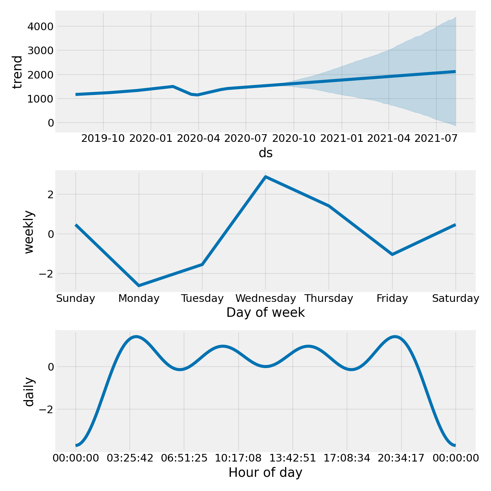

# Google Stock Price Prediction using Facebook Prophet

Wanted to try something different from the usual LSTM approach for time series, Prophet handles seasonality out of the box and the results are actually interpretable, which I liked. Used Google's historical stock data and forecasted 365 days ahead.

---

## What this is

Most stock prediction projects just throw an LSTM at the data and call it a day. Prophet is different, it explicitly models trend + weekly seasonality + yearly seasonality as separate components, so you can actually understand *why* it's predicting what it's predicting.

This project uses Meta's Prophet library on Google (GOOG) historical closing prices to forecast the next year of stock movement.

---

## Dataset

Google (GOOG) historical stock data from Yahoo Finance.

| Column | Description |
|--------|-------------|
| Date | Trading date |
| Open | Opening price |
| High | Daily high |
| Low | Daily low |
| Close | **Closing price (used for prediction)** |
| Volume | Number of shares traded |

Download: [GOOG.csv](dataset/GOOG.csv)  
Source: [Yahoo Finance](https://finance.yahoo.com/quote/GOOG)

---

## Project Structure

```
stock-price-prediction/
│
├── dataset/
│   └── GOOG.csv
├── notebook/
│   └── stock_price_prediction.ipynb
├── images/
│   ├── closing_price.png
│   ├── prediction.png
│   └── components.png
├── requirements.txt
└── README.md
```

---

## What I did

**1. Explored the data**  
Plotted the raw closing price history to get a feel for the overall trend before touching any model.

**2. Prepared data for Prophet**  
Prophet is strict about input format, needs exactly two columns named `ds` (date) and `y` (value). Extracted just `Date` and `Close`, renamed them, and converted `ds` to datetime.

**3. Trained the model**  
Fitted Prophet with `daily_seasonality=True`. Training is fast, Prophet isn't a neural network, it's a curve-fitting model using Stan under the hood, so no GPU needed.

**4. Forecasted 365 days ahead**  
Used `make_future_dataframe(periods=365)` to extend the date range and `predict()` to get `yhat` (prediction), `yhat_lower` and `yhat_upper` (confidence interval bounds).

**5. Analyzed components**  
The components plot was the most useful part — breaks the forecast into trend, weekly pattern, and yearly pattern separately.

---

## Results

**Historical Closing Price**


**365-Day Forecast**  
Black dots = actual data, blue line = predicted, shaded region = uncertainty interval


**Seasonal Components**  
Trend + weekly seasonality + yearly seasonality broken down individually



---

## Key Observations

- Long-term trend is strongly upward as expected for GOOG
- Weekly pattern shows slight dip early in the week likely reflects trading behavior
- Yearly seasonality shows mid-year peaks, which loosely aligns with earnings season activity
- Confidence interval widens significantly for future dates honest uncertainty quantification

---

## Why Prophet over LSTM?

| | Prophet | LSTM |
|--|---------|------|
| Interpretability | High & decomposed components | Low — black box |
| Training speed | Very fast (seconds) | Slow (minutes to hours) |
| Handles seasonality | Built-in | Needs manual feature engineering |
| Data needed | Works on smaller datasets | Needs a lot of data |
| Best for | Trend + seasonal patterns | Complex sequential patterns |

For stock data with clear yearly and weekly patterns, Prophet is actually a solid choice and much easier to explain.

---

## How to run

```bash
git clone https://github.com/kushagrakaushik1k/stock-price-prediction
cd stock-price-prediction
pip install -r requirements.txt
```

Open `notebook/stock_price_prediction.ipynb` in VS Code or Jupyter and run all cells.

> **Note:** Use `prophet` not `fbprophet` — fbprophet is the old package name and breaks on Python 3.9+.

---

## Requirements

```
pandas
numpy
matplotlib
prophet
```

---

## Takeaways

- Prophet's decomposition approach makes forecasting explainable in a way LSTM can't match
- The uncertainty intervals are genuinely useful, they widen over time, which is honest about how predictable stock prices actually are.
- For anything with strong seasonal patterns, Prophet should be the first thing you try before going deep learning.

---

## References

- [Original article by Aman Kharwal](https://amanxai.com/2020/08/09/stock-price-prediction-with-facebook-prophet-model/)
- [Prophet Documentation](https://facebook.github.io/prophet/)
- [GOOG data — Yahoo Finance](https://finance.yahoo.com/quote/GOOG)